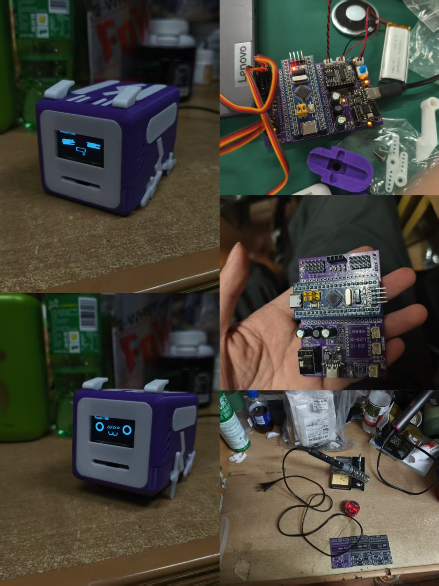
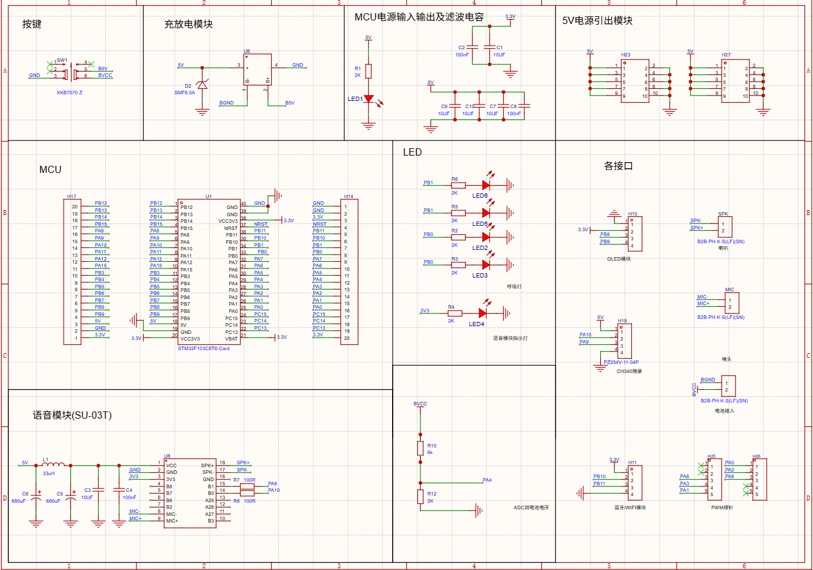
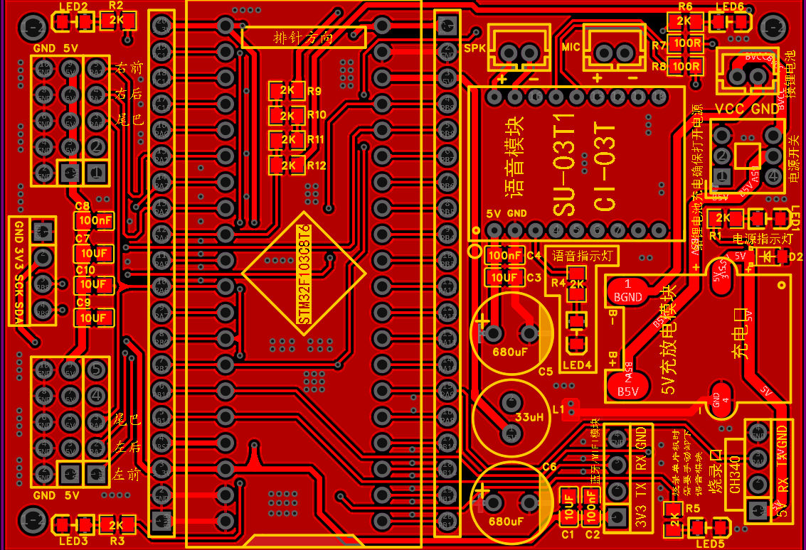

# 基于 STM32 的智能小狗综合控制系统

基于 STM32F103C8T6 主控芯片设计的桌面级仿生四足机器人，集成舵机运动控制、SU-03T1 离线语音识别、HC-05 蓝牙无线遥控、OLED 状态显示等功能，并搭建电阻分压式 ADC 电压检测网络实时监测锂电池电压，实现完整的机电一体化控制系统。

---

## 系统架构

```
┌───────────────────────────────────────────────────┐
│                   STM32F103C8T6 主控              │
├─────────┬─────────┬─────────┬─────────┬─────────┤
│ 电源管理 │ 舵机驱动 │ 语音识别 │ 蓝牙通信 │ 状态显示 │
└─────────┴─────────┴─────────┴─────────┴─────────┘
```

### 硬件电源链路

- 3.7V 锂电池 → 5V 充放电模块 → 5V 电源输入 PCB 右上角
- 5V 一路直接为舵机供电，一路经 **AMS-1117-3.3V** 稳压至 3.3V 为逻辑电路供电（5V / 3.3V 双电压轨）
- 上电正常时板载 LED 指示灯点亮

### 核心模块与接口

- **主控单元**：STM32F103C8T6 最小系统，负责整机逻辑控制与指令处理
- **执行单元（舵机）**：舵机供电接板子左侧上下两侧 5V 排针；PWM 信号线分配如下
  - PA0 → 左前脚
  - PA1 → 右前脚
  - PA2 → 左后脚
  - PA3 → 右后脚
  - PA6 → 尾巴舵机
- **OLED 显示屏**：接桌宠板最左侧中间排母处
- **HC-05 蓝牙模块（USART3）**：接板子右下角排母处；排母标注 TX 为单片机 RX 复用口，标注 RX 为单片机 TX 复用口
- **SU-03T1 语音模块（USART1，固件限定 SU-03T1）**：接板子右上角排母处；排母标注 TX 为单片机 TX 复用口，标注 RX 为单片机 RX 复用口
- **检测单元**：电阻分压式 ADC 电压采集网络，实时采集锂电池电压，由 OLED 显示

---

## 硬件设计亮点

- 独立完成主控最小系统、电源管理、舵机驱动、通信模块的全链路硬件方案设计
- 采用 3.7V 锂电池 + 5V 充放电管理方案，经 AMS-1117-3.3V 稳压提供 5V/3.3V 双电源轨
- 设计电阻分压式 ADC 电压检测电路，实时监测锂电池电压并通过 OLED 显示
- 2 层 PCB 紧凑布局，适配机器人机身结构尺寸，兼顾电气性能与机械安装
- 各模块接口引出排针/排母并预留测试点，便于单独调试与故障排查

---

## 实物展示

### 整机与调试过程



### 系统原理图



### PCB 布局图



---

## 实现功能

- **离线语音控制**：SU-03T1 语音模块识别指令，控制机器人完成前进、后退、转向等动作
- **蓝牙无线遥控**：HC-05（USART3）连接手机，实现远程运动控制
- **状态实时显示**：OLED 屏幕实时显示电池电压、工作模式、运行状态等信息
- **电量监测**：ADC 实时采集锂电池电压，实现电量状态显示
- **上电指示**：上电正常板载 LED 点亮

---

## 开发与调试

- 使用立创EDA 完成原理图设计与 2 层 PCB 绘制
- 独立完成电路板手工焊接、各模块单独调试与系统联调
- 成功验证语音控制、蓝牙遥控、OLED 状态显示、电量监测等全部功能，运行稳定可靠

---


---

## 后续改进方向

- 优化四足步态控制算法，提升运动流畅度与稳定性
- 增加姿态传感器，实现闭环平衡控制
- 拓展更多语音指令与交互功能
